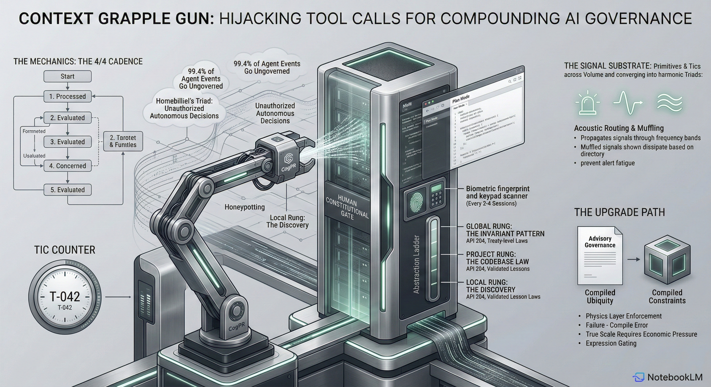
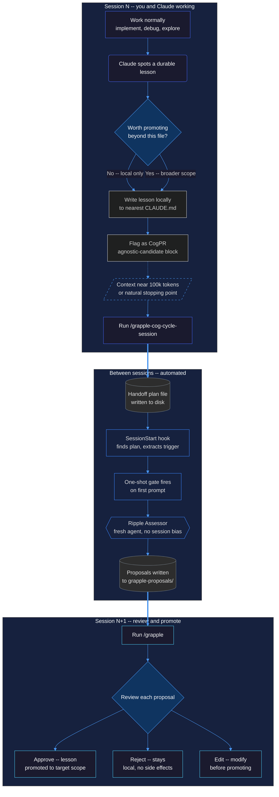
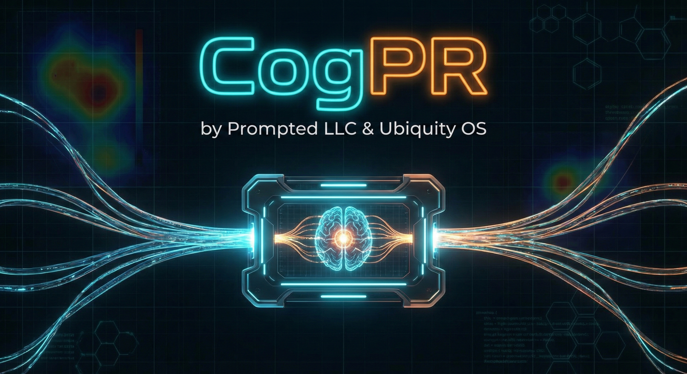

<p align="center">
  
</p>

# Context Grapple Gun -- Practical developer guide

> **Want the theory?** See [`README.md`](README.md) for the abstraction ladder model and signal architecture.

**A CI/CD pipeline for your AI's memory and system prompts.**

> **Curious about the theory behind the pipeline?** Read the [Architecture & Design Rationale](ARCHITECTURE.md).

You've been here: Claude Code solves a gnarly race condition at 2am. You close the session. Tomorrow, same agent, same repo -- it has no idea what it learned last night. You re-explain the fix, or worse, watch it make the same mistake again.

CGG fixes this. The agent captures lessons as it works, drafts them as "Cognitive Pull Requests," and queues them for your review. You approve the ones worth keeping. Next session, those lessons are loaded. The agent gets smarter over time instead of resetting to zero.

## The DevOps mapping

You already know these concepts under different names:

| CGG | You know it as |
|-----|---------------|
| CogPR | Pull Request for your CLAUDE.md, not your codebase |
| Ripple Assessor | CI test runner that checks proposed rules against existing prompts |
| `/grapple` | Code review. You approve, reject, or edit the proposed changes |
| `/siren` | Datadog / PagerDuty. Tracks recurring friction, alerts on threshold breach |
| `/grapple-cog-cycle-session` | Graceful shutdown with cleanup hooks |

## How a session actually flows



## The 100k rule and working across a roadmap

Context windows are finite. Around 100k tokens, Claude Code starts losing grip on early-session context. CGG turns this constraint into a feature.

Hit `/grapple-cog-cycle-session` at or before the 100k mark. The session writes a handoff file, captures pending lessons, and shuts down cleanly. Next session picks up where you left off, but the lessons from Session N are already evaluated and queued for review.

Over a multi-week roadmap, this creates a rhythm:

**Session 1**: Implement auth middleware. Discover that your JWT library silently accepts expired tokens in test mode. Write lesson locally, flag CogPR.

**Session 2**: `/grapple` surfaces the JWT lesson. You approve it to project scope. Now every future session in this repo knows about the test-mode footgun. Continue to rate limiting.

**Session 3**: Rate limiter work hits a Redis connection pooling issue. New lesson captured. Meanwhile, the JWT lesson is already paying off -- Claude avoids the test-mode trap without being told.

**Session 4**: `/grapple` review. You've got 3-4 accumulated lessons. Some are project-specific. One about Redis connection semantics might be global -- it applies to your other repos too. You promote that one up the abstraction ladder.

This is the cadence. Four beats, steady time:

1. **Work** -- implement, debug, ship
2. **Capture** -- `/grapple-cog-cycle-session` before context degrades
3. **Evaluate** -- ripple assessor runs between sessions, no human involvement
4. **Review** -- `/grapple` to approve, reject, or promote

Repeat. The agent compounds knowledge autonomously within each project. You review in cadence -- not every session, but every few sessions, whenever the `/grapple` queue has enough proposals to justify the context cost.

After enough cycles, something interesting happens downstream. A global lesson like "always validate embedding dimensions before similarity computation" gets picked up by a new project. But that project uses Rust, not Python. The agent writes a local specialization -- same core signal, project-specific expression. The global lesson said *what* to check. The local expression knows *how* to check it in this codebase. The abstraction ladder works in both directions.

## Packages

### 1. `cogpr/` -- The convention layer
Markdown standards that teach Claude how to flag lessons. Works in Claude Code, Claude Desktop, and Claude for Work. No infrastructure -- just conventions.

### 2. `cgg-runtime/` -- The automation engine
Claude Code only. Hooks into the session lifecycle to automate capture, evaluation, and proposal generation. Turns conventions into a pipeline.

## Installation

Install both packages in one pass:

1. Add the submodule:
   ```bash
   git submodule add https://github.com/prompted365/context-grapple-gun.git vendor/context-grapple-gun
   ```

2. Copy into `.claude/`:
   ```bash
   # Skills
   cp -r vendor/context-grapple-gun/cogpr/claude-code/skills/* .claude/skills/
   cp -r vendor/context-grapple-gun/cgg-runtime/skills/* .claude/skills/

   # Hooks and agents
   cp -r vendor/context-grapple-gun/cgg-runtime/hooks .claude/
   cp -r vendor/context-grapple-gun/cgg-runtime/agents .claude/
   ```

3. Wire the hooks:
   ```
   /init-gun
   /init-cogpr
   ```

For Claude Desktop or Claude for Work, copy `cogpr/claude-desktop/project-instructions.md` into your project's custom instructions. You get the convention layer but not the automated pipeline.

## Daily workflow

<p align="center">
  
</p>

1. **Work normally.** Debug, implement, explore. Claude captures lessons as it goes.

2. **Claude flags a lesson.** When it hits something durable -- a non-obvious API behavior, a deployment gotcha, an architectural constraint -- it drops a `<!-- --agnostic-candidate -->` CogPR flag in the local file.

3. **End the session.** Run `/grapple-cog-cycle-session` before context degrades. This bundles everything into a handoff file and stages the CogPRs.

4. **Between sessions.** The SessionStart hook fires automatically. A fresh agent evaluates the pending PRs without session bias.

5. **Review.** Type `/grapple` when you're ready. Approve the lessons that matter, reject the noise.

## Commands

| Command | What it does |
|---------|-------------|
| `/grapple-cog-cycle-session` | Session shutdown. Writes handoff, stages CogPRs, cleans context. |
| `/grapple` | Review dashboard. Approve or reject proposed prompt changes. |
| `/siren` | Monitoring. View active friction signals and background alerts. |
| `/init-gun` | One-time setup. Wires hooks and patches settings. |
| `/init-cogpr` | One-time setup. Verifies convention layer is in place. |

## Safety

CGG never modifies `CLAUDE.md` without your explicit approval through `/grapple`. Background triggers fire exactly once per handoff. Lessons learned in one project don't leak into another -- everything is scoped by `project_dir`.

## Maintainers

[Prompted LLC](https://prompted.community/) -- part of the Ubiquity OS ecosystem.

Breyden Taylor -- [LinkedIn](https://www.linkedin.com/in/breyden-taylor/) | breyden@prompted.community

Contributions welcome.
