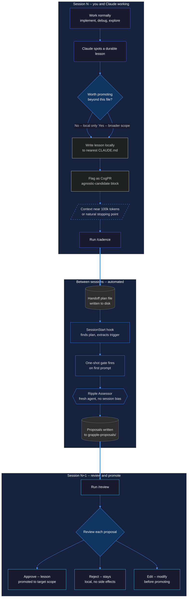
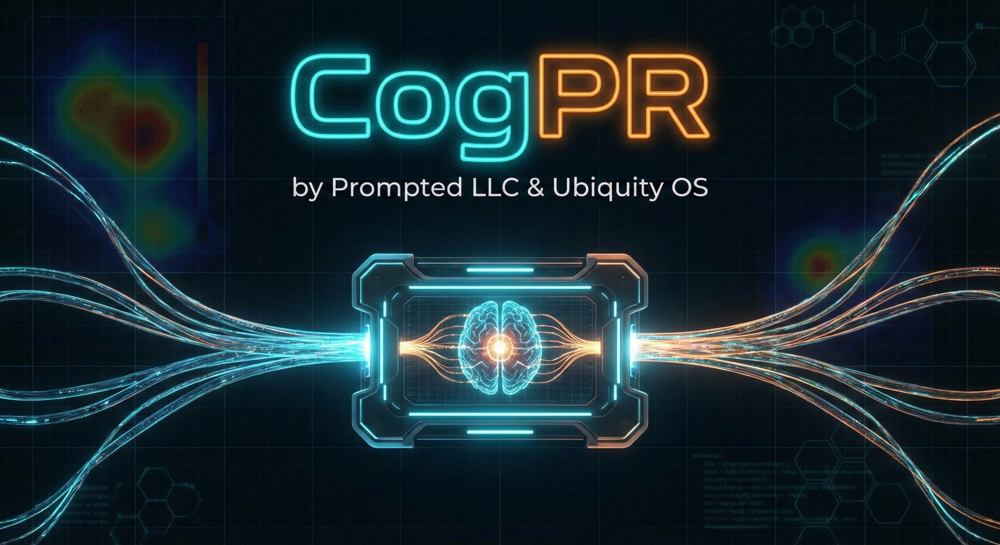

  

# Context Grapple Gun -- Practical developer guide

> **Just want the commands?** [START-HERE.md](START-HERE.md). **Full reference?** [README.md](README.md). **Architecture and design rationale?** [ARCHITECTURE.md](ARCHITECTURE.md).

**A CI/CD pipeline for your AI's memory and system prompts.**

You've been here: Claude Code solves a gnarly race condition at 2am. You close the session. Tomorrow, same agent, same repo -- it has no idea what it learned last night. You re-explain the fix, or worse, watch it make the same mistake again.

CGG fixes this. The agent captures lessons as it works, drafts them as "Cognitive Pull Requests," and queues them for your review. You approve the ones worth keeping. Next session, those lessons load automatically. The agent compounds instead of resetting to zero.

## The DevOps mapping

You already know these concepts under different names:

| CGG | You know it as |
|-----|---------------|
| CogPR | Pull Request for your CLAUDE.md, not your codebase |
| Ripple Assessor | CI test runner that checks proposed rules against existing prompts |
| `/review` | Code review. You approve, reject, or edit the proposed changes |
| `/siren` | Datadog / PagerDuty. Tracks recurring friction, alerts on threshold breach |
| `/cadence` | Epoch boundary — emits tic, captures lessons, writes handoff |

## Governance truth surfaces

**Tags are authoring. Queue is execution. Audit logs are history.**

Tags in CLAUDE.md/MEMORY.md are the capture format. The CPR queue (JSONL) drives automation. Audit logs are append-only history. Details in [ARCHITECTURE.md §11](ARCHITECTURE.md).

## How a session actually flows

```mermaid
%%{init: {'theme': 'dark', 'flowchart': {'padding': 24, 'rankSpacing': 60, 'nodeSpacing': 40}, 'themeVariables': {'primaryColor': '#4361ee', 'primaryTextColor': '#f8f9fa', 'primaryBorderColor': '#6c757d', 'lineColor': '#4895ef', 'secondaryColor': '#1a1a2e', 'tertiaryColor': '#16213e', 'edgeLabelBackground': '#1a1a2e', 'clusterBkg': '#16213e', 'clusterBorder': '#3d3d3d', 'noteTextColor': '#e0e0e0', 'noteBkgColor': '#2d2d2d'}}}%%
flowchart TB
    subgraph S1["Session N -- you and Claude working"]
        direction TB
        A["Work normally<br/>implement, debug, explore"]
        B("Claude spots a durable lesson")
        C{"Worth promoting<br/>beyond this file?"}
        D["Write lesson locally<br/>to nearest CLAUDE.md"]
        E["Flag as CogPR<br/>agnostic-candidate block"]
        F[/"Context near 100k tokens<br/>or natural stopping point"/]
        G["Run /cadence"]

        A --> B
        B --> C
        C -- "No -- local only" --> D
        C -- "Yes -- broader scope" --> D
        D --> E
        E -.-> F
        F --> G
    end

    subgraph BT["Between sessions -- automated"]
        direction TB
        H[("Handoff plan file<br/>written to disk")]
        I["SessionStart hook<br/>finds plan, extracts trigger"]
        J["One-shot gate fires<br/>on first prompt"]
        K{{"Ripple Assessor<br/>fresh agent, no session bias"}}
        L[("Proposals written<br/>to grapple-proposals/")]

        H --> I
        I --> J
        J --> K
        K --> L
    end

    subgraph S2["Session N+1 -- review and promote"]
        direction TB
        M["Run /review"]
        N{"Review each proposal"}
        O["Approve -- lesson<br/>promoted to target scope"]
        P["Reject -- stays<br/>local, no side effects"]
        Q["Edit -- modify<br/>before promoting"]

        M --> N
        N --> O
        N --> P
        N --> Q
    end

    G ===> H
    L ===> M

    classDef work fill:#1a1a2e,stroke:#4361ee,color:#f8f9fa
    classDef decision fill:#0f3460,stroke:#4895ef,color:#f8f9fa
    classDef auto fill:#16213e,stroke:#3a86ff,color:#e0e0e0
    classDef store fill:#2d2d2d,stroke:#6c757d,color:#e0e0e0
    classDef review fill:#1a1a2e,stroke:#4cc9f0,color:#f8f9fa
    classDef trigger fill:#16213e,stroke:#4895ef,color:#e0e0e0,stroke-dasharray: 5 5

    class A,B,G work
    class C,N decision
    class I,J,K auto
    class H,L store
    class M,O,P,Q review
    class F trigger
```

## Session cadence and the 100k heuristic

Context windows are finite. Around 100k tokens, early-session context starts getting stale -- this is a heuristic, not a hard wall. Some sessions run longer, some shorter. The point is: end the epoch before the agent's reasoning degrades. CGG turns this constraint into a feature.

Run `/cadence` when the session feels ready to wrap -- 100k tokens is a reasonable checkpoint, not a countdown timer. The downbeat emits a canonical tic (a sequenced timestamp providing total ordering across agents and cadences), writes a handoff file, captures pending lessons, and shuts down cleanly.

If you've blown past the heuristic and context is visibly degrading (repetition, forgetting earlier decisions, slow responses), use `/cadence double-time`. It produces a valid handoff with minimal ceremony: tic + compact plan, no signal tick or conformation snapshot. The next session can run a full downbeat when context is fresh. Think of it as the emergency exit -- same building, different door.

Next session picks up where you left off, with Session N's lessons already evaluated and queued for review. The tic sequence lets you reconstruct what the system knew at any point -- not just by clock time, but by ordinal position.

Over a multi-week roadmap, this creates a rhythm:

**Session 1**: Implement auth middleware. Discover that your JWT library silently accepts expired tokens in test mode. Write lesson locally, flag CogPR.

**Session 2**: `/review` surfaces the JWT lesson. You approve it to project scope. Every future session in this repo now knows about the test-mode footgun. Continue to rate limiting.

**Session 3**: Rate limiter work hits a Redis connection pooling issue. New lesson captured. The JWT lesson is already paying off -- Claude avoids the test-mode trap without being told.

**Session 4**: `/review` again. 3-4 accumulated lessons. Some are project-specific. One about Redis connection semantics applies to your other repos too. Promote that one up the abstraction ladder.

The cadence. Four beats, steady time:

1. **Work** -- implement, debug, ship
2. **Capture** -- `/cadence` before context degrades
3. **Evaluate** -- ripple assessor runs between sessions, no human involvement
4. **Review** -- `/review` to approve, reject, or promote

Repeat. The agent compounds knowledge within each project. You review every few sessions, whenever the `/review` queue has enough proposals to justify the context cost.

### Zone scanning and governance surface

CGG scans specific files, not everything. The zone scan rule:

1. Project root = directory containing `.ticzone` (or CWD if no zone file)
2. Governance files = `**/CLAUDE.md` and `**/MEMORY.md` inside the zone
3. Auto-memory (`~/.claude/projects/*/memory/MEMORY.md`) is always included
4. `.ticignore` exclusions are applied (default: vendor/, node_modules/, .git/, .claude/skills/)
5. Blocks with `status: "example"` are skipped (documentation templates)

This prevents phantom counts from template files, vendor docs, and archived skill definitions. If your `/review` docket shows unexpected pending CPRs, check whether `.ticignore` covers the source directory.

After enough cycles, the abstraction ladder pays off. A global lesson like "always validate embedding dimensions before similarity computation" gets picked up by a new project. That project uses Rust, not Python. The agent writes a local specialization -- same core signal, project-specific expression. The global lesson said *what* to check. The local expression knows *how* to check it in this codebase. The ladder works both directions.

## Packages

### 1. `cogpr/` -- The convention layer
Markdown standards that teach Claude how to flag lessons. Works in Claude Code, Claude Desktop, and Claude for Work. No infrastructure -- just conventions.

### 2. `cgg-runtime/` -- The automation engine
Claude Code only. Hooks into the session lifecycle to automate capture, evaluation, and proposal generation. Turns conventions into a pipeline. The runtime assumes `.ticzone` and `.ticignore` at project root for scan boundary resolution. Install creates these if missing.

## Installation

Paste the bootstrap prompt into Claude Code. It asks one question (install mode), then handles everything -- submodule, skills, hooks, agents, wiring. See [INSTALL.md](INSTALL.md) for the exact prompt.

For Claude Desktop or Claude for Work, copy `cogpr/claude-desktop/project-instructions.md` into your project's custom instructions. You get the convention layer but not the automated pipeline.

## Daily workflow

  

1. **Work normally.** Debug, implement, explore. Claude captures lessons as it goes.

2. **Claude flags a lesson.** It hits something durable -- a non-obvious API behavior, a deployment gotcha, an architectural constraint -- and drops a `<!-- --agnostic-candidate -->` CogPR flag in the local file.

3. **End the session.** Run `/cadence` before context degrades. This emits a tic, bundles everything into a handoff file, and stages the CogPRs.

4. **Between sessions.** The SessionStart hook fires automatically. A fresh agent evaluates the pending PRs without session bias.

5. **Review.** Type `/review` when you're ready. Approve the lessons that matter, reject the noise.

## Commands

| Command | What it does |
|---------|-------------|
| `/cadence` | Epoch boundary. Emits tic, writes handoff, stages CogPRs, cleans context. Use `/cadence double-time` for emergency mode. |
| `/review` | Review dashboard. Approve or reject proposed prompt changes. |
| `/siren` | Monitoring. View active friction signals and background alerts. |

## Deterministic assessor option

The trigger gate spawns a fresh Claude agent (the ripple-assessor) to evaluate pending CogPRs between sessions. No configuration needed — the default path is the LLM agent.

For faster, cheaper, more predictable evaluation, drop a `scripts/ripple-assessor.py` into your project root. The gate hook checks for this file first — if it exists, it runs the Python script directly instead of spawning an LLM agent. Same inputs, same output path (`~/.claude/grapple-proposals/latest.md`), no API cost.

Simple installs get the agent. Mature installs get deterministic evaluation. The gate handles both.

As the project matures and CPR volume grows, a deterministic script also lets you add the two maturity gates (temporal and epistemic) as cheap arithmetic checks rather than LLM reasoning — see [ARCHITECTURE.md](ARCHITECTURE.md#9-cpr-maturity-fields-concrete-spec) for the field spec.

## Safety

CGG never modifies `CLAUDE.md` without your approval through `/review`. Background triggers fire exactly once per handoff. Lessons from one project don't leak into another -- everything is scoped by `project_dir`.

## Where CGG fits

CGG is a compact expression of the Ubiquity concurrent development methodology. Session boundaries, lesson promotion, signal monitoring, human review gates -- three commands and flat files.

There's a ceiling. As signal stores grow, grep-based dedup slows down. As lesson corpora span dozens of files, finding the right lesson for the current context requires semantic understanding, not keyword matching. That ceiling is where deeper substrate layers begin -- embedding-based recall, graph topology, expression gating, conformation-aware retrieval. Those need infrastructure CGG deliberately avoids.

Start here. When flat files aren't enough, you'll know.

### Measuring impact

Three numbers tell you whether CGG is compounding:

1. **Repeat-mistake rate** -- compare CogPR failure codes against subsequent session friction. Declining = lessons are landing.
2. **Time-to-resume** -- seconds from session start to first productive tool call. Good handoffs compress this.
3. **Promotion ROI** -- how often a promoted rule prevents a future incident. A promoted rule that never fires again has infinite ROI.

See [ARCHITECTURE.md](ARCHITECTURE.md#measuring-cggs-impact) for the full measurement rationale.

## Maintainers

**[Prompted LLC](https://promptedllc.com)** -- creators of the Ubiquity governance substrate.

Breyden Taylor, Founder & Architect -- [LinkedIn](https://www.linkedin.com/in/breyden-taylor/) | breyden@prompted.community

Contributions welcome.
