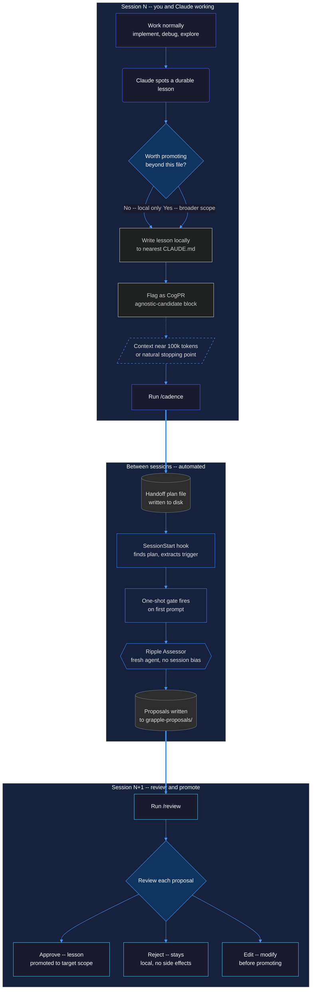

  

# Context Grapple Gun — Developer Guide

> **Just want the commands?** [START-HERE.md](START-HERE.md). **Full reference?** [README.md](README.md). **Architecture and design rationale?** [ARCHITECTURE.md](ARCHITECTURE.md). **Learn through story?** [academy/README.md](academy/README.md).

**A CI/CD-style review and promotion pipeline for durable agent lessons and operating rules.**

CGG captures lessons as the agent works, queues them for review, and promotes approved lessons to broader scope. The agent compounds instead of resetting to zero.

---

## If you only learn five concepts

| Concept | What it means | DevOps equivalent |
|---------|---------------|-------------------|
| **CogPR** | A proposed lesson flagged for review and potential promotion | Pull request (for behavior rules, not code) |
| **Abstraction ladder** | Scope hierarchy: Site → Domain → Estate → Federation → Global | Environment promotion (dev → staging → prod) |
| **Epoch boundary** | End of session via `/cadence`. Emits tic, bundles lessons, writes handoff. | Deploy boundary |
| **Human gate** | Every scope promotion requires `/review` approval | Code review |
| **Signal** | Recurring friction that accrues volume across sessions | PagerDuty alert |

Once you have these, everything else is detail.

---

## The DevOps mapping

You already know these concepts under different names:

| CGG | You know it as |
|-----|---------------|
| CogPR | Pull Request for your CLAUDE.md, not your codebase |
| Ripple Assessor | CI test runner that checks proposed rules against existing prompts |
| `/review` | Code review. You approve, reject, or edit the proposed changes |
| `/siren` | Datadog / PagerDuty. Tracks recurring friction, alerts on threshold breach |
| `/cadence` | Deploy/release boundary — emits tic, captures lessons, writes handoff |
| Abstraction ladder | Environment promotion (dev → staging → prod) |
| Warrant | Pager alert — auto-escalation when signal crosses threshold |

---

## Core terms with neutral aliases

| CGG term | Neutral systems term | What it means |
|----------|---------------------|---------------|
| **tic** | Sequenced timestamp | ISO-8601 timestamp + monotonic counter. Emitted at every `/cadence`. |
| **tic-zone** | Jurisdiction boundary | Named acoustic region defined by `.ticzone`; scopes signal routing |
| **siren** | Friction signal | Continuous signal with volume that accrues across sessions |
| **warrant** | Escalation obligation | Auto-minted when signal crosses threshold; demands resolution |
| **conformation** | System state snapshot | Total state at any tic boundary |
| **chorus** | Failure synthesis | Post-failure compression into institutional memory |

For the full glossary, see [docs/TERMINOLOGY.md](docs/TERMINOLOGY.md).

---

## Governance truth surfaces

**Tags are authoring. Queue is execution. Audit logs are history.**

Tags in CLAUDE.md/MEMORY.md are the capture format. The CogPR queue (JSONL) drives automation. Audit logs are append-only history. Details in [ARCHITECTURE.md §11](ARCHITECTURE.md).

---

## How a session actually flows

```mermaid
%%{init: {'theme': 'dark', 'flowchart': {'padding': 24, 'rankSpacing': 60, 'nodeSpacing': 40}, 'themeVariables': {'primaryColor': '#4361ee', 'primaryTextColor': '#f8f9fa', 'primaryBorderColor': '#6c757d', 'lineColor': '#4895ef', 'secondaryColor': '#1a1a2e', 'tertiaryColor': '#16213e', 'edgeLabelBackground': '#1a1a2e', 'clusterBkg': '#16213e', 'clusterBorder': '#3d3d3d', 'noteTextColor': '#e0e0e0', 'noteBkgColor': '#2d2d2d'}}}%%
flowchart TB
    subgraph S1["Session N -- you and Claude working"]
        direction TB
        A["Work normally<br/>implement, debug, explore"]
        B("Claude spots a durable lesson")
        C{"Worth promoting<br/>beyond this file?"}
        D["Write lesson locally<br/>to nearest CLAUDE.md"]
        E["Flag as CogPR<br/>agnostic-candidate block"]
        F[/"Context near 100k tokens<br/>or natural stopping point"/]
        G["Run /cadence"]

        A --> B
        B --> C
        C -- "No -- local only" --> D
        C -- "Yes -- broader scope" --> D
        D --> E
        E -.-> F
        F --> G
    end

    subgraph BT["Between sessions -- automated"]
        direction TB
        H[("Handoff plan file<br/>written to disk")]
        I["SessionStart hook<br/>finds plan, extracts trigger"]
        J["One-shot gate fires<br/>on first prompt"]
        K{{"Ripple Assessor<br/>fresh agent, no session bias"}}
        L[("Proposals written<br/>to grapple-proposals/")]

        H --> I
        I --> J
        J --> K
        K --> L
    end

    subgraph S2["Session N+1 -- review and promote"]
        direction TB
        M["Run /review"]
        N{"Review each proposal"}
        O["Approve -- lesson<br/>promoted to target scope"]
        P["Reject -- stays<br/>local, no side effects"]
        Q["Edit -- modify<br/>before promoting"]

        M --> N
        N --> O
        N --> P
        N --> Q
    end

    G ===> H
    L ===> M

    classDef work fill:#1a1a2e,stroke:#4361ee,color:#f8f9fa
    classDef decision fill:#0f3460,stroke:#4895ef,color:#f8f9fa
    classDef auto fill:#16213e,stroke:#3a86ff,color:#e0e0e0
    classDef store fill:#2d2d2d,stroke:#6c757d,color:#e0e0e0
    classDef review fill:#1a1a2e,stroke:#4cc9f0,color:#f8f9fa
    classDef trigger fill:#16213e,stroke:#4895ef,color:#e0e0e0,stroke-dasharray: 5 5

    class A,B,G work
    class C,N decision
    class I,J,K auto
    class H,L store
    class M,O,P,Q review
    class F trigger
```

## Session cadence and the 100k heuristic

Context windows are finite. Around 100k tokens, early-session context starts getting stale -- this is a heuristic, not a hard wall. Some sessions run longer, some shorter. The point is: end the epoch before the agent's reasoning degrades. CGG turns this constraint into a feature.

Run `/cadence` when the session feels ready to wrap -- 100k tokens is a reasonable checkpoint, not a countdown timer. The downbeat emits a canonical tic (a sequenced timestamp providing total ordering across agents and cadences), writes a handoff file, captures pending lessons, and shuts down cleanly.

If you've blown past the heuristic and context is visibly degrading (repetition, forgetting earlier decisions, slow responses), use `/cadence double-time`. It produces a valid handoff with minimal ceremony: tic + compact plan, no signal tick or conformation snapshot. The next session can run a full downbeat when context is fresh. Think of it as the emergency exit -- same building, different door.

Next session picks up where you left off, with Session N's lessons already evaluated and queued for review. The tic sequence lets you reconstruct what the system knew at any point -- not just by clock time, but by ordinal position.

Over a multi-week roadmap, this creates a rhythm:

**Session 1**: Implement auth middleware. Discover that your JWT library silently accepts expired tokens in test mode. Write lesson locally, flag CogPR.

**Session 2**: `/review` surfaces the JWT lesson. You approve it to project scope. Every future session in this repo now knows about the test-mode footgun. Continue to rate limiting.

**Session 3**: Rate limiter work hits a Redis connection pooling issue. New lesson captured. The JWT lesson is already paying off -- Claude avoids the test-mode trap without being told.

**Session 4**: `/review` again. 3-4 accumulated lessons. Some are project-specific. One about Redis connection semantics applies to your other repos too. Promote that one up the abstraction ladder.

### Two kinds of lessons

CogPRs capture two distinct classes of rationale:

**Subject-matter lessons** — what's true about the system:
- "This API returns 204 on success, not 200"
- "Redis connections use a shared pool — never open individual connections in handlers"
- "LiteLLM embedding calls require the provider prefix on model name"

**Collaboration lessons** — what's true about effective coordination:
- "When constructing subagent prompts, include a theory-of-mind preface describing the agent's strengths and limitations"
- "Prefer structured validation messages over implicit corrections"
- "Run tests after each small change rather than batching"

Both are valid CogPR candidates. Both climb the abstraction ladder. Both pass through the same constitutional gate.

The runtime is harvesting lessons from subject work AND working method. A technique you develop for briefing subagents -- structuring prompts to account for conceptual drift, providing explicit context the agent tends to assume -- can legitimately surface as a promotion candidate after it proves valuable across sessions.

Example: You notice the agent drifts when prompts don't explicitly scope the abstraction level. You start adding a one-line context preface. After several sessions, the system surfaces this as a candidate: "When delegating multi-step tasks, include explicit abstraction-level scoping to prevent conceptual drift." That's a collaboration lesson, and it's just as promotable as any API quirk.

The cadence. Four beats, steady time:

1. **Work** -- implement, debug, ship
2. **Capture** -- `/cadence` before context degrades
3. **Evaluate** -- ripple assessor runs between sessions, no human involvement
4. **Review** -- `/review` to approve, reject, or promote

Repeat. The agent compounds knowledge within each project. You review every few sessions, whenever the `/review` queue has enough proposals to justify the context cost.

### Zone scanning and governance surface

CGG scans specific files, not everything. The zone scan rule:

1. Project root = directory containing `.ticzone` (or CWD if no zone file)
2. Governance files = `**/CLAUDE.md` and `**/MEMORY.md` inside the zone
3. Auto-memory (`~/.claude/projects/*/memory/MEMORY.md`) is always included
4. `.ticignore` exclusions are applied (default: vendor/, node_modules/, .git/, .claude/skills/)
5. Blocks with `status: "example"` are skipped (documentation templates)

This prevents phantom counts from template files, vendor docs, and archived skill definitions. If your `/review` docket shows unexpected pending CPRs, check whether `.ticignore` covers the source directory.

After enough cycles, the abstraction ladder pays off. A global lesson like "always validate embedding dimensions before similarity computation" reaches a new site. That site uses Rust, not Python. The site interprets the global law in its local context — same core signal, situated validation. The global lesson said *what* to check. The local interpretation knows *how* to validate it in this codebase.

The ladder works in both directions. Upward: extract → generalize → canonicalize. Downward: apply → interpret → audit → validate. Higher-scope law descends by applicability claim and runtime interpretation, not by automatic lower-scope inscription. Lower scopes validate whether broader law carries load in context. If it fails there, the canonical law is amended, narrowed, split, or demoted at its own rung. Lower-scope writing occurs only for local origin, explicit exception, or explicitly reviewed boundary.

## Packages

### 1. `cogpr/` -- The convention layer
Markdown standards that teach Claude how to flag lessons. Works in Claude Code, Claude Desktop, and Claude for Work. No infrastructure -- just conventions.

### 2. `cgg-runtime/` -- The automation engine
Claude Code only. Hooks into the session lifecycle to automate capture, evaluation, and proposal generation. Turns conventions into a pipeline. The runtime assumes `.ticzone` and `.ticignore` at project root for scan boundary resolution. Install creates these if missing.

**Topology awareness**: The runtime includes rung resolution (`zone_root.resolve_rung_position()`) that detects topology markers (`.domain-root`, `.estate-root`, `.federation-root`) above the site. Run `cgg-doctor.sh` to see your current topology. Higher-rung markers are optional — site-only is the default and fully functional.

### Runtime install scope

The automation engine has two distinct surface classes:

#### Runtime surfaces
Installed to one of:
- `~/.claude/...` (default, user/global)
- `$ZONE_ROOT/.claude/...` (project override only)

These include:
- skills
- hooks
- agents
- settings registration

#### Zone-local governance surfaces
Always remain at project zone root:
- `.ticzone`
- `.ticignore`
- `audit-logs/`
- project governance files

This distinction matters:
runtime embodiment may be global while governance jurisdiction remains project-local.

Runtime scope and governance scope are different things.
Default runtime scope is user/global.
Default governance scope remains project-local unless promoted through the ladder.

## Installation

`npx context-grapple-gun install` — see [INSTALL.md](INSTALL.md) for all options, modes, and scopes.

## Daily workflow

  

1. **Work normally.** Debug, implement, explore. Claude captures lessons as it goes.

2. **Claude flags a lesson.** It hits something durable -- a non-obvious API behavior, a deployment gotcha, an architectural constraint -- and drops a `<!-- --agnostic-candidate -->` CogPR flag in the local file.

3. **End the session.** Run `/cadence` before context degrades. This emits a tic, bundles everything into a handoff file, and stages the CogPRs.

4. **Between sessions.** The SessionStart hook fires automatically. A fresh agent evaluates the pending PRs without session bias.

5. **Review.** Type `/review` when you're ready. Approve the lessons that matter, reject the noise.

## Commands

| Command | What it does |
|---------|-------------|
| `/cadence` | Epoch boundary. Emits tic, writes handoff, stages CogPRs, cleans context. Use `/cadence double-time` for emergency mode. |
| `/review` | Review dashboard. Approve or reject proposed prompt changes. |
| `/siren` | Monitoring. View active friction signals and background alerts. |

## Deterministic assessor option

The trigger gate spawns a fresh Claude agent (the ripple-assessor) to evaluate pending CogPRs between sessions. No configuration needed — the default path is the LLM agent.

For faster, cheaper, more predictable evaluation, the gate hook checks for a deterministic assessor script via a 3-path resolution chain: (1) `$ZONE_ROOT/scripts/ripple-assessor.py` (project override), (2) `$CGG_SCRIPTS_DIR/ripple-assessor.py` (plugin-root-anchored bundled script at `cgg-runtime/scripts/`), (3) `$HOME/.claude/cgg-runtime/scripts/ripple-assessor.py` (global fallback). If found, it runs the Python script directly instead of spawning an LLM agent. Same inputs, same output path (`~/.claude/grapple-proposals/latest.md`), no API cost.

Simple installs get the agent. Mature installs get deterministic evaluation. The gate handles both.

As the project matures and CogPR volume grows, a deterministic script also lets you add the two maturity gates (temporal and epistemic) as cheap arithmetic checks rather than LLM reasoning — see [ARCHITECTURE.md](ARCHITECTURE.md#9-cpr-maturity-fields-concrete-spec) for the field spec.

## CogPR Extraction Pipeline

The CogPR queue (`audit-logs/cprs/queue.jsonl`) is populated by `cpr-extract.py`, called from the **SessionStart hook** (`session-restore.sh`). This is a deliberate design choice:

- **Why SessionStart, not PostToolUse**: CogPR extraction scans CLAUDE.md and MEMORY.md for `<!-- --agnostic-candidate -->` blocks. The SessionStart hook has access to the full governance surface and runs deterministically at every session boundary.
- **Synchronous extraction**: `cpr-extract.py` runs inline during SessionStart, scanning the CLAUDE.md/MEMORY.md chain for tagged blocks and populating `queue.jsonl` via dedup hash (`sha256(source:lesson)[:16]`).
- **Two extraction paths** (both use the same dedup hash):
  1. **SessionStart primary** — `cpr-extract.py` scans governance surfaces for `--agnostic-candidate` blocks
  2. **SessionStart backfill** — inline block counting in `session-restore.sh` as a safety net for queue integrity

Running both on the same CogPR produces exactly one queue entry. The queue is eventually consistent.

## Safety

CGG never modifies `CLAUDE.md` without your approval through `/review`. Background triggers fire exactly once per handoff. Lessons from one project don't leak into another -- everything is scoped by `project_dir`.

## Where CGG fits

CGG is a scalable lexical governance layer for human rationale. Session boundaries, lesson promotion, signal monitoring, human review gates — three commands and flat files.

Human rationale is the scarce substrate AI governance is trying to encode. CGG changes the economics of that encoding by distinguishing direct learning (task/domain truths), indirect learning (process/tooling/coordination truths), and meta learning (truths about learning, review, and governance themselves). The tiers answer where a lesson is allowed to matter. The abstraction ladder answers at what level of generality it should be expressed. Neither conflates with the other.

There's a ceiling. As signal stores grow, grep-based dedup slows down. As lesson corpora span dozens of files, finding the right lesson for the current context requires semantic understanding, not keyword matching. The abstraction ladder delays that ceiling; pattern mining delays it further; but neither abolishes it. When flat files aren't enough, you'll know — and CGG's primitives become the audit trail beneath whatever substrate you adopt.

### Measuring impact

Three numbers tell you whether CGG is compounding:

1. **Repeat-mistake rate** -- compare CogPR failure codes against subsequent session friction. Declining = lessons are landing.
2. **Time-to-resume** -- seconds from session start to first productive tool call. Good handoffs compress this.
3. **Promotion ROI** -- how often a promoted rule prevents a future incident. A promoted rule that never fires again has infinite ROI.

See [ARCHITECTURE.md](ARCHITECTURE.md#measuring-cggs-impact) for the full measurement rationale.

## Constitutional learning loops

A constitutional governance loop wraps the entire system: experience generates proposals, proposals require human review, review produces promotion or rejection, and the operating constitution updates accordingly. Humans author law. Agents execute within it.

```mermaid
flowchart TB
    subgraph Fast["Fast loop — active session"]
        Work[Work session] --> Capture[Capture CogPR + signals]
        Capture --> Cadence[/`/cadence` end-of-session/]
    end

    Cadence --> Plan[Plan with trigger]
    Plan --> Assessor[Background ripple-assessor]
    Assessor --> Proposals[Proposals file]

    subgraph Gate["Human gate — constitutional review"]
        Proposals --> Review[/`/review` docket/]
        Review -->|approve| Promote[Promote scope (Site→...→Global)]
        Review -->|reject/modify| Iterate[Refine lesson or handler]
    end

    Promote --> Manifest[Manifest in CLAUDE.md + runtime hooks]
    Manifest --> SessionRestore[Next session restore]
    SessionRestore --> Work

    Manifest --> Signals[Runtime signals]
    Signals -->|threshold| Warrant[Warrant minted]
    Warrant --> Review
    Signals -.background pressure.- Cadence
```

### The unified flow: how knowledge survives context death

The system runs three loops at different speeds. The **fast loop** is your working session -- implement, debug, verify. The **medium loop** is site memory, where validated lessons accumulate across sessions. The **slow loop** is global memory, where universal invariants settle after enough cross-site validation. The 100k token cycle destroys the local context window, but because the CogPR buffer feeds site and global memory asynchronously, knowledge arcs over the destruction event and cascades into the next session.

The `/review` human review isn't just a safety check -- it's the epoch boundary. It marks the moment where Session N's raw discoveries become Session N+1's upgraded starting state. The agent should have amnesia after the context flush. It doesn't, because the abstraction ladder carried the knowledge through.

### The abstraction ladder (detailed)

Knowledge in CGG lives on a scope hierarchy -- the abstraction ladder. Lessons move in both directions: upward through extract > generalize > canonicalize, and downward through apply > interpret > audit > validate.

**Rungs:**

- **Site** -- a lesson at the project root's `CLAUDE.md` or `MEMORY.md`. True across this codebase. The default working rung.
- **Domain** -- cross-module within a site. Useful when a project has distinct subsystems.
- **Estate** -- cross-project governance. When multiple repos share an operator or team.
- **Federation** -- cross-organization. When multiple estates coordinate. Rare.
- **Global** -- a lesson promoted to `~/.claude/CLAUDE.md`. True across every project on the machine. This is a treaty, not a convenience.

**Climbing:** A lesson climbs when a CogPR is approved through `/review`. The ripple assessor checks scope correctness. Promotion requires evidence: at least 2 full pipeline cycles for global scope, cross-validation where relevant, no schema churn that would invalidate it next week. Two maturity gates formalize this: a temporal gate (`tic_gated`) and an epistemic gate (`enrichment_eligible`). See [ARCHITECTURE.md](ARCHITECTURE.md#9-cpr-maturity-fields-concrete-spec) for the field spec.

**Descending:** Higher-scope law descends by applicability claim and runtime interpretation, not by automatic lower-scope inscription. Lower scopes validate whether broader law carries load in context. If it fails there, the canonical law is amended at its own rung. Lower-scope writing is reserved for local origin, explicit exception, or explicitly reviewed boundary.

### The lexical ceiling

CGG is the portable lexical governance layer. Human rationale is the scarce substrate AI governance is trying to encode. CGG changes the economics of that encoding by making rationale compound in governed form.

**But text has a ceiling.** Lesson corpora grow, nested projects add weight, and walls of text dilute force. Mitigations built in: scoped zones, the abstraction ladder, signal decay, and human curation during `/review`. But neither abolishes the ceiling.

**Beyond the ceiling:** expression gating, conformation-aware retrieval, graph topology, economic pressure, and compiled constraints live outside this repo. CGG stays flat-file and auditable; when you need those capabilities, CGG's primitives become the audit trail beneath whatever substrate you adopt. See [ARCHITECTURE.md](ARCHITECTURE.md#6-scaling-ceiling).

### Applicability

CGG is model-agnostic and host-agnostic. Claude Code is the current primary host, but the primitives port to any agent framework.

- **Engineering teams** -- CogPRs are pull requests for agent behavior. The ripple assessor is the CI runner. `/review` is code review.
- **Regulated industries** -- audit trail where every rule change is a CogPR with reviewable diff, approval timestamp, and scope designation.
- **Public sector** -- all state lives in flat, human-readable files. `git log` as the audit tool. Tic-zones enforce agency-level compartmentalization.
- **Multi-agent coordination** -- shared clock (tics), shared jurisdiction (zones), shared governance (the ladder).

## Maintainers

**[Prompted LLC](https://promptedllc.com)** -- creators of the Ubiquity governance substrate.

Breyden Taylor, Founder & Architect -- [LinkedIn](https://www.linkedin.com/in/breyden-taylor/) | breyden@prompted.community

Contributions welcome.
