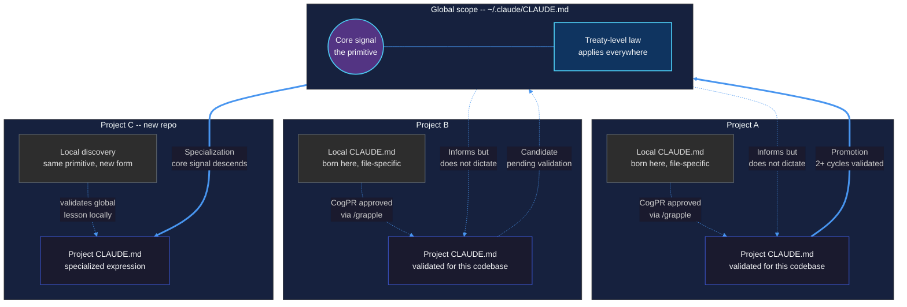

<p align="center">
  
</p>

> **New to the terminal?** Start with [`START-HERE.md`](START-HERE.md) -- plain language, four commands, 60-second install.
> **Developer?** The practical guide is [`DEV-README.md`](DEV-README.md).
> **Architect?** Read the [Architecture & Design Rationale](ARCHITECTURE.md).

# Context Grapple Gun

CGG is a file-based governance layer for persistent AI systems. It locks in agent behavior through scoped rule promotion, epoch boundaries, canonical timestamping, and human constitutional review. No databases, no running services, no external dependencies -- flat files, git-tracked, auditable by default.

It solves a hard problem: when an AI agent discovers something true during a work session -- a bug pattern, an API quirk, an architectural constraint -- that knowledge vanishes with the context window. The next session starts from zero. In multi-agent or multi-team deployments, there's no path for one agent's hard-won lesson to reach another without manually rewriting system prompts.

CGG gives knowledge a lifecycle. Lessons are captured locally, evaluated by a fresh agent between sessions, and promoted to broader scopes with human approval at every gate. Runtime conditions get monitored through a parallel signal system using acoustic routing, volume accrual, and automatic escalation. Every epoch boundary emits a canonical tic -- a sequentially numbered timestamp that provides total ordering across agents, cadences, and jurisdictions.

Over time, the project's operating rules grow from real work, not from someone sitting down to write documentation. The system extracts what actually mattered.


### Why CGG exists

Organizations running persistent AI systems hit a specific set of problems that better models don't solve:

- **Behavioral drift over time.** Agents gradually contradict their own constraints as context windows fill and rotate.
- **No rule evolution pathway.** When an agent discovers a better way to operate, the insight dies with the session. Manually updating system prompts doesn't scale.
- **Invisible blast radius.** When an agent's behavior changes, there's no audit trail showing what changed, when, why, or who approved it.
- **Cross-system incoherence.** Multiple agents in the same domain have no way to share validated lessons or coordinate on discovered constraints.
- **Jurisdictional ambiguity.** In regulated or multi-team environments, you can't define which agents can hear which signals, or which rules apply in which scope.

CGG addresses these through five structural mechanisms: the abstraction ladder (scoped rule tiers), the epoch boundary (context rotation discipline), the human constitutional gate (approval-gated promotion), the signal manifold (runtime condition monitoring), and the tic/tic-zone system (canonical ordering and jurisdictional scoping).

## The abstraction ladder

Knowledge in CGG lives on a scope hierarchy. We call it the abstraction ladder because lessons climb it -- and sometimes descend it.

### Rungs

**Local** -- a lesson written to the nearest `CLAUDE.md` or `MEMORY.md` from wherever the agent is working. Born from a specific file in a specific context. Example: "This API endpoint returns 204 on success, not 200."

**Project** -- a lesson promoted to the project's root `CLAUDE.md`. True across the entire codebase. Example: "Our Redis connections use a shared pool -- never open individual connections in request handlers."

**Global** -- a lesson promoted to `~/.claude/CLAUDE.md`. True across every project on the machine. This is a treaty, not a convenience. Example: "LiteLLM embedding calls require the provider prefix on the model name even when api_base is set."

### Climbing: local to global

A lesson climbs when a CogPR is approved through `/grapple`. The ripple assessor checks scope correctness -- a Redis connection pattern specific to one project shouldn't become global law. Promotion requires evidence:

- At least 2 full pipeline cycles for global scope
- Cross-validation where relevant -- does the lesson hold in other projects?
- No schema churn that would invalidate it next week

The governance invariant is this: the system must be willing to refuse premature promotion even when the lesson is accurate. An accurate lesson with immature validation stays at project scope until it earns its way up. The first test of whether the system actually governs is whether it can say "not yet."

### Descending: global to local

This is the less obvious direction, and it matters more than it appears.

A global lesson carries a core signal -- the primitive, the actual thing that's true. But how that truth expresses itself differs by project. When a global lesson lands in a new project context, it often needs a local specialization: same core signal, project-specific expression.

Example: a global lesson says "always validate embedding dimensions before similarity computation." In Project A, that's a NumPy shape check in Python. In Project B, it's a dimension guard before `iter().zip()` in Rust -- because Rust's zip silently truncates mismatched iterators and produces wrong results without an error. The primitive is identical. The expression is specialized.

This downstream flow keeps the ladder honest. Global lessons stay concrete because their project-level expressions test them against real codebases. If a global lesson can't produce a useful specialization in a new project, it probably shouldn't be global. The bottom keeps the top sharp.



### The unified flow: how knowledge survives context death

The system runs three loops concurrently at different speeds. The **fast loop** is your working session -- implement, debug, verify. The **medium loop** is project memory, where validated lessons accumulate across sessions. The **slow loop** is global memory, where universal invariants settle after enough cross-project validation. The 100k token cycle destroys the local context window, but because the CogPR buffer feeds project and global memory asynchronously, knowledge arcs over the destruction event and cascades into the next session.


The `/grapple` human review isn't just a safety check -- it's the epoch boundary. It marks the moment where Session N's raw discoveries become Session N+1's upgraded starting state. The agent should have amnesia after the context flush. It doesn't, because the abstraction ladder carried the knowledge through.

### The 4/4 cadence

Four beats, steady time:

| Beat | Action | What happens |
|------|--------|-------------|
| 1 | **Work** | Implement, debug, ship. Lessons are a side effect of real work. |
| 2 | **Capture** | `/cadence-downbeat` at or before 100k tokens. Tic emitted, handoff written, CogPRs staged. |
| 3 | **Evaluate** | Between sessions, ripple assessor runs automatically. No human involvement. |
| 4 | **Review** | `/grapple` when the queue warrants it -- every 2-4 sessions, not every session. |

You might run beats 1 and 2 three times before doing beat 4. The review cadence is driven by proposal density, not a fixed schedule. The agent learns at project level on its own between beats 1 and 3. You shape what sticks and what climbs during beat 4.

## Signal architecture

Alongside the lesson lifecycle, CGG runs a parallel signal system for runtime conditions. These aren't lessons to promote -- they're states to monitor.

### Primitives

**Whisper** -- a micro-correction injected at runtime to prevent immediate failure. Low-latency, local, ephemeral.

**Siren** -- a continuous signal with volume that accrues over time. Same friction point appears across sessions, the signal gets louder. Propagation follows an acoustic model: volume at source minus distance-based muffling. Signals below a target's hearing threshold exist in the manifold but don't interrupt.

**Warrant** -- minted automatically when a signal's volume crosses threshold, or when three signal types converge within 24 hours. BEACON + LESSON + TENSION in the same window is a "harmonic triad" -- auto-escalation without volume accrual. Warrants are obligations, not suggestions.

**CogPR** -- the lesson primitive. Discrete, reviewable, promotable. Covered in depth above.

**Chorus** -- post-failure compression into durable institutional memory. Slow, synthesizing. "Don't repeat this class of failure."

### Frequency bands

| Band | Propagation | Use |
|------|-------------|-----|
| PRIMITIVE | Always audible, never fully muffled | Safety, data integrity, survival |
| COGNITIVE | Standard working level | Lessons, insights, process fixes |
| SOCIAL | High muffling, suppressed | Coordination between agents |
| PRESTIGE | Auto-muted, blocked by governance | Never optimized for |

PRESTIGE exists to be blocked. Any signal that would accrue reputation or status is filtered. The system optimizes for truth propagation, not clout.

### Quiet rail principle

Most of this runs silently. Signals accrue volume, assessors run between sessions, proposals queue up -- none of it interrupts the developer. You see the system only during `/grapple` review. Everything else is auditable after the fact but invisible during work.

Think of it less as an alert system and more as a geological survey: instruments always recording, data read when you choose to.

### Tic (canonical clock primitive)

A tic is both a timestamp and a sequence number. This distinction matters.

A timestamp tells you *when* something happened. A monotonic counter tells you *in what order*. Tics provide both -- an ISO-8601 timestamp paired with project and global sequence counters. This gives you three audit capabilities simultaneously:

- **Temporal**: "What did the system know at 2026-02-24T21:15:00?"
- **Sequential**: "What happened between tic 42 and tic 47, regardless of wall-clock time?"
- **Cross-cadence**: "Agent A's tic #3 occurred between Agent B's tic #41 and #42" -- even though they run on completely different rhythms.

Different systems emit tics at different cadences. A Claude Code agent downbeats at the 100k token mark. An Agent Zero superintendent downbeats at monologue boundaries. A cron job downbeats on a fixed schedule. None share a rhythm, but they all share the tic sequence. The tic counter is the total ordering that makes syncopated cadences commensurable.

Every `/cadence-downbeat` emits a tic. Tics accumulate at two scopes:
- **Project tic counter**: derived by counting `"type": "tic"` entries in `audit-logs/tics/*.jsonl`
- **Global tic counter**: `~/.claude/cgg-tic-counter.json` -- simple `{"count": N, "last_tic": "ISO-8601"}`

Tic record format (appended to `audit-logs/tics/YYYY-MM-DD.jsonl`):
```json
{
  "type": "tic",
  "tic": "2026-02-24T21:15:00-05:00",
  "tic_zone": "operationTorque-estate",
  "cadence_position": "downbeat",
  "scope": "project",
  "tic_count_project": 42,
  "tic_count_global": 137
}
```

Tics are stored separately from signals (`audit-logs/tics/`, not `audit-logs/signals/`). The clock is not a signal -- tics are exempt from TTL expiry, muffling, volume accrual, and warrant triads.

### Tic-zone (acoustic region)

A tic-zone is a named acoustic region defined by a `.ticzone` file (JSONC -- `//` comments and trailing commas accepted) at the zone root. It defines the acoustic space for banded communications. All systems within a zone share the tic primitive regardless of their cadence position.

```jsonc
{
  "name": "operationTorque-estate",
  "tz": "America/Toronto",
  "lat": 43.6532,
  "lon": -79.3832,
  "include": [".", "~/.claude"],
  "bands": ["PRIMITIVE", "COGNITIVE", "SOCIAL", "PRESTIGE"],
  "muffling_per_hop": 5
}
```

- `name`: Zone identifier used in tic records and acoustic routing.
- `tz`: IANA timezone. Maps the zone to Earth's temporal grid.
- `lat`/`lon`: Optional geographic coordinates for future spatial coupling.
- `include`: Paths belonging to this zone. Relative paths resolved from `.ticzone` location.
- `bands`: Active frequency bands in this zone.
- `muffling_per_hop`: Acoustic muffling constant for the zone's distance model.

A `.ticignore` file (gitignore-style) excludes paths from the zone's acoustic space. Signals originating from ignored paths are not routed.

Zone nesting: a `.ticzone` in a subdirectory creates a nested zone inheriting the parent's `tz` and `bands` unless overridden. Muffling crosses zone boundaries at 2x the per-hop rate.

### System conformation

At any tic boundary, the total state of a CGG-governed system forms a conformation: which signals are active, which CogPRs are pending, which warrants are minted, what the drift measurements show, which zone you're in, what rules are in force at each scope tier.

Between tic N and tic N+1, environmental pressure -- work, friction, discovery -- causes the conformation to shift. Most shifts are small: a local lesson captured, a signal volume incremented. Some are fold events: a warrant mints from a harmonic triad (three independent signal types converging), or a global rule gets promoted that reshapes how every downstream project operates.

The tic sequence makes this replayable. You can reconstruct the system's exact conformation at any tic boundary, diff it against the previous one, and trace exactly what caused the transition. This audit primitive works at every abstraction level -- an engineer reads it as "what changed between sessions," a compliance officer reads it as "what rules were in force when this decision was made," and the system itself reads it as "what shape am I in."

The sequence is the primary structure. The signals, warrants, and CogPRs are side chains. The bands are charge groups. The acoustic routing is the solvent. The conformation at any given tic is the folded shape of the system under accumulated pressure.

## Applicability

CGG is model-agnostic and host-agnostic. Claude Code is the current primary host, but the primitives -- flat-file signal stores, append-only JSONL, YAML/JSONC config, human-gated promotion -- are portable to any agent framework.

### Engineering teams

The CI/CD mental model is intentional. CogPRs are pull requests for agent behavior, not codebases. The ripple assessor is the CI runner. `/grapple` is code review. Engineers already know these workflows. CGG maps directly onto them.

### Regulated industries

For organizations where AI behavioral changes require documented approval chains -- fintech, healthcare, defense, legal -- CGG provides:

- **Audit trail**: Every rule change is a CogPR with a reviewable diff, approval timestamp, and scope designation. Every epoch boundary emits a sequenced tic.
- **Blast radius containment**: Scoped memory tiers ensure a lesson validated in one project cannot silently propagate to another without climbing the abstraction ladder through human gates.
- **Jurisdictional mapping**: Tic-zones define which agents operate in which acoustic regions, which bands are active, and how signals attenuate across boundaries.

### Public sector

Government AI deployments have specific constraints that CGG addresses:

- **FOIA readiness**: All state is in flat, human-readable files. No databases to subpoena, no APIs to query. `git log` is the audit tool.
- **Administration epochs**: Tic counters and epoch boundaries map cleanly to fiscal years, legislative sessions, and administration changes. Rules can be version-controlled per epoch.
- **Compartmentalization**: Tic-zones enforce that signals from one agency's agents cannot propagate into another agency's acoustic space without explicit zone inclusion.
- **Constitutional gate**: The human approval requirement for rule promotion mirrors the principle that AI systems execute policy -- they do not make it.

### Multi-agent coordination

When multiple agents operate in the same domain with different cadences, CGG provides the shared clock (tics), shared jurisdiction (zones), and shared governance (the abstraction ladder) that prevent drift into incoherence. Each agent maintains its own rhythm. The tic sequence is how they stay synchronized without being coupled.

## Where CGG fits

CGG is a compact, portable expression of principles from the Ubiquity concurrent development methodology. Install it in 30 seconds, get enormous value from session 1. Four commands. Zero dependencies.

It scales well for individuals and small teams. But there's a ceiling. As your signal store, lesson corpus, and memory files grow, flat-file governance starts to creak. Signals accumulate without semantic compression. Lessons pile up without topological organization. The system knows more and more, but finding the right knowledge at the right time gets harder -- grep doesn't understand meaning.

That ceiling is where Ubiquity's deeper layers begin: embedding-based semantic recall, graph topology for relational memory, methylation for expression gating across timescales, and conformation-aware retrieval that matches the system's current shape to its historical failure modes. These aren't introductory concepts, and they don't fit neatly into a Claude Code CLI framework. They require infrastructure -- vector databases, embedding models, graph engines.

CGG is the governance lifecycle. Ubiquity is the substrate that makes it scale. Start here. When flat files aren't enough, you'll know.

### When CGG stops being enough

You'll feel the ceiling when:
- Signals exceed a few hundred entries and dedup becomes slow
- Lessons span many files and grep stops finding the right thing
- You need "closest historical failure mode," not "keyword overlap"
- Rule stores grow monotonically and every session loads stale context

Ubiquity layers that extend CGG: semantic recall (embeddings), graph topology (relational memory), expression gating (methylation/dormancy), and conformation-aware retrieval (shape matching). Same governance lifecycle underneath -- the flat-file primitives become the audit trail beneath the substrate.

See [ARCHITECTURE.md](ARCHITECTURE.md#6-scaling-ceiling) for the full design rationale and upgrade path.

### Measuring impact

Three numbers that tell you whether CGG is compounding or just accumulating:

1. **Repeat-mistake rate** -- declining = lessons are landing
2. **Time-to-resume** -- shrinking = handoffs are working
3. **Promotion ROI** -- promoted rules that prevent future incidents = compounding

## Packages

### `cogpr/` -- Cognitive Pull Request conventions

The convention layer. Markdown standards for flagging lessons and reviewing promotions. Works in Claude Code, Claude Desktop, and Claude for Work.

| Variant | Path | What it does |
|---------|------|-------------|
| Claude Code | `cogpr/claude-code/` | Skills with YAML frontmatter |
| Claude Desktop | `cogpr/claude-desktop/` | Project instructions snippet |
| Claude for Work | `cogpr/claude-work/` | Project instructions snippet |

### `cgg-runtime/` -- Trigger pipeline

Claude Code only. Automation connecting lesson capture to evaluation to review.

| Component | Purpose |
|-----------|---------|
| `hooks/cgg-gate.sh` | One-shot gate on first prompt |
| `hooks/session-restore-patch.sh` | Plan discovery and trigger extraction |
| `agents/ripple-assessor.md` | Fresh evaluator agent |
| `skills/` | `/init-gun`, `/siren`, `/cadence-downbeat` |

## Installation

### Claude Code -- full pipeline

1. Add the submodule:
   ```bash
   git submodule add https://github.com/prompted365/context-grapple-gun.git vendor/context-grapple-gun
   ```

2. Copy both packages:
   ```bash
   cp -r vendor/context-grapple-gun/cogpr/claude-code/skills/* .claude/skills/
   cp -r vendor/context-grapple-gun/cgg-runtime/hooks .claude/
   cp -r vendor/context-grapple-gun/cgg-runtime/agents .claude/
   cp -r vendor/context-grapple-gun/cgg-runtime/skills/* .claude/skills/
   ```

3. Wire hooks: `/init-gun` then `/init-cogpr`

### Claude Desktop / Claude for Work

Copy `cogpr/claude-desktop/project-instructions.md` into your project's custom instructions. Convention layer only -- CogPR flagging and manual review, no automated pipeline.

## Safety

All promotions require human approval through `/grapple`. Protected files like `~/.claude/CLAUDE.md` require extra confirmation. Trigger blocks are structured data with whitelisted keys, not executable instructions. Each handoff is processed at most once. Project scoping prevents cross-project bleed.

## License

MIT

## Maintainers

[Prompted](https://prompted.community) -- part of the Ubiquity OS ecosystem.

Breyden Taylor -- [LinkedIn](https://www.linkedin.com/in/breyden-taylor/) | breyden@prompted.community

Contributions welcome.
