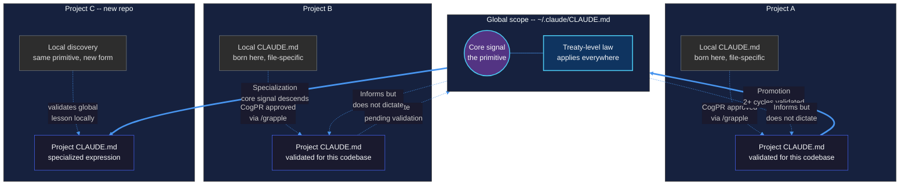
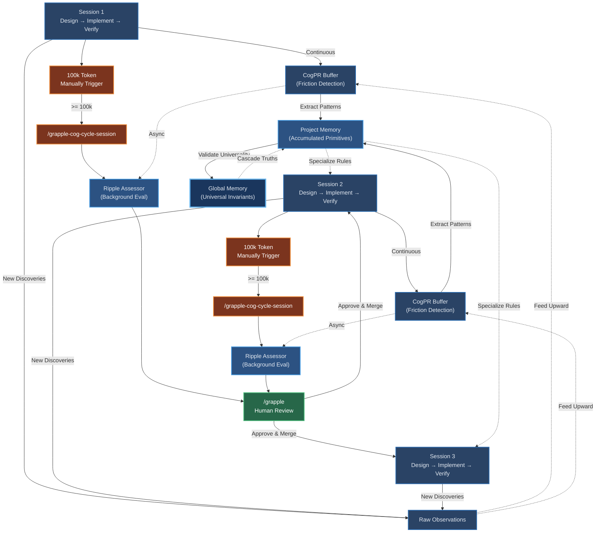

<p align="center">
  
</p>

> **Looking for the practical developer guide?** See [`DEV-README.md`](DEV-README.md).

# Context Grapple Gun

CGG is a governance framework for persistent AI agents that need to learn across sessions without drifting. It solves a specific problem: when an agent discovers something true during a work session -- a bug pattern, an API quirk, an architectural constraint -- that knowledge dies with the context window. The next session starts from zero.

CGG gives that knowledge a lifecycle. Lessons are captured locally, evaluated by a fresh agent between sessions, and promoted to broader scopes with human approval at every gate. Over time, the project's system prompts grow from real work -- not because someone sat down to write documentation, but because the system extracted what actually mattered.

## The abstraction ladder

Knowledge in CGG lives on a scope hierarchy. We call it the abstraction ladder because lessons climb it -- and sometimes descend it.

### Rungs

**Local** -- a lesson written to the nearest `CLAUDE.md` or `MEMORY.md` from wherever the agent is working. Born from a specific file in a specific context. Example: "This API endpoint returns 204 on success, not 200."

**Project** -- a lesson promoted to the project's root `CLAUDE.md`. True across the entire codebase. Example: "Our Redis connections use a shared pool -- never open individual connections in request handlers."

**Global** -- a lesson promoted to `~/.claude/CLAUDE.md`. True across every project on the machine. This is a treaty, not a convenience. Example: "LiteLLM embedding calls require the provider prefix on the model name even when api_base is set."

### Climbing: local to global

A lesson climbs when a CogPR is approved through `/grapple`. The ripple assessor evaluates scope correctness -- a Redis connection pattern specific to one project shouldn't become global law. Promotion requires evidence:

- At least 2 full pipeline cycles for global scope
- Cross-validation where relevant -- does the lesson hold in other projects?
- No schema churn that would invalidate it next week

The governance invariant: the system must be willing to refuse premature promotion even when the lesson is accurate. An accurate lesson with immature validation stays at project scope until it earns its way up. The first proof of governability is the ability to say "not yet."

### Descending: global to local

This is the less obvious direction, and it matters more than it first appears.

A global lesson carries a core signal -- the primitive, the actual thing that's true. But how that truth expresses itself differs by project. When a global lesson lands in a new project context, it often needs a local specialization: same core signal, project-specific expression.

Example: a global lesson says "always validate embedding dimensions before similarity computation." In Project A, that's a NumPy shape check in Python. In Project B, it's a dimension guard before `iter().zip()` in Rust -- because Rust's zip silently truncates mismatched iterators and produces wrong results without an error. The primitive is identical. The expression is specialized.

This downstream flow keeps the ladder honest. Global lessons stay concrete because their project-level expressions test them against real codebases. If a global lesson can't produce a useful specialization in a new project, it probably shouldn't be global. The top of the ladder stays sharp because the bottom keeps filing it.



### The unified flow: how knowledge survives context death

The system runs three loops concurrently at different speeds. The **fast loop** is your working session -- implement, debug, verify. The **medium loop** is project memory, where validated lessons accumulate across sessions. The **slow loop** is global memory, where universal invariants settle after enough cross-project validation. The 100k token cycle-session trigger physically destroys the local context window, but because the CogPR buffer feeds project and global memory asynchronously, knowledge arcs over the destruction event and cascades into the next session.



The `/grapple` human review isn't just a safety check -- it's the epoch boundary. It marks the moment where Session N's raw discoveries become Session N+1's upgraded starting state. The agent should have amnesia after the context flush. It doesn't, because the abstraction ladder carried the knowledge through.

### The 4/4 cadence

Four beats, steady time:

| Beat | Action | What happens |
|------|--------|-------------|
| 1 | **Work** | Implement, debug, ship. Lessons are a side effect of real work. |
| 2 | **Capture** | `/grapple-cog-cycle-session` at or before 100k tokens. Handoff written, CogPRs staged. |
| 3 | **Evaluate** | Between sessions, ripple assessor runs automatically. No human involvement. |
| 4 | **Review** | `/grapple` when the queue warrants it -- every 2-4 sessions, not every session. |

You might run beats 1 and 2 three times before doing beat 4. The review cadence is driven by proposal density, not a fixed schedule. The agent learns at project level autonomously between beats 1 and 3. You shape what sticks and what climbs during beat 4.

## Signal architecture

Alongside the lesson lifecycle, CGG runs a parallel signal system for runtime conditions -- not lessons to promote, but states to monitor.

### Primitives

**Whisper** -- a micro-correction injected at runtime to prevent immediate failure. Low-latency, local, ephemeral.

**Siren** -- a continuous signal with volume that accrues over time. Same friction point across sessions, the signal gets louder. Propagation follows an acoustic model: volume at source minus distance-based muffling. Signals below a target's hearing threshold exist in the manifold but don't interrupt.

**Warrant** -- minted automatically when a signal's volume crosses threshold, or when three signal types converge within 24 hours. BEACON + LESSON + TENSION within the same window is a "harmonic triad" -- auto-escalation without volume accrual. Warrants are obligations, not suggestions.

**CogPR** -- the lesson primitive. Discrete, reviewable, promotable. Covered in depth above.

**Chorus** -- post-failure compression into durable institutional memory. Slow, synthesizing. "Don't repeat this class of failure."

### Frequency bands

| Band | Propagation | Use |
|------|-------------|-----|
| PRIMITIVE | Always audible, never fully muffled | Safety, data integrity, survival |
| COGNITIVE | Standard working level | Lessons, insights, process fixes |
| SOCIAL | High muffling, suppressed | Coordination between agents |
| PRESTIGE | Auto-muted, blocked by governance | Never optimized for |

PRESTIGE exists to be blocked. Any signal that would accrue reputation or status is filtered. The system optimizes for truth propagation, not clout.

### Quiet rail principle

Most of this runs silently. Signals accrue volume, assessors run between sessions, proposals queue up -- none of it interrupts the developer. You see the system only during `/grapple` review. Everything else is auditable after the fact but invisible during work.

The right analogy isn't an alert system. It's closer to a geological survey: instruments always recording, data read when you choose to.

## Packages

### `cogpr/` -- Cognitive Pull Request conventions

The convention layer. Markdown standards for flagging lessons and reviewing promotions. Works in Claude Code, Claude Desktop, and Claude for Work.

| Variant | Path | What it does |
|---------|------|-------------|
| Claude Code | `cogpr/claude-code/` | Skills with YAML frontmatter |
| Claude Desktop | `cogpr/claude-desktop/` | Project instructions snippet |
| Claude for Work | `cogpr/claude-work/` | Project instructions snippet |

### `cgg-runtime/` -- Trigger pipeline

Claude Code only. Automation connecting lesson capture to evaluation to review.

| Component | Purpose |
|-----------|---------|
| `hooks/cgg-gate.sh` | One-shot gate on first prompt |
| `hooks/session-restore-patch.sh` | Plan discovery and trigger extraction |
| `agents/ripple-assessor.md` | Fresh evaluator agent |
| `skills/` | `/init-gun`, `/siren`, `/grapple-cog-cycle-session` |

## Installation

### Claude Code -- full pipeline

1. Add the submodule:
   ```bash
   git submodule add https://github.com/prompted365/context-grapple-gun.git vendor/context-grapple-gun
   ```

2. Copy both packages:
   ```bash
   cp -r vendor/context-grapple-gun/cogpr/claude-code/skills/* .claude/skills/
   cp -r vendor/context-grapple-gun/cgg-runtime/hooks .claude/
   cp -r vendor/context-grapple-gun/cgg-runtime/agents .claude/
   cp -r vendor/context-grapple-gun/cgg-runtime/skills/* .claude/skills/
   ```

3. Wire hooks: `/init-gun` then `/init-cogpr`

### Claude Desktop / Claude for Work

Copy `cogpr/claude-desktop/project-instructions.md` into your project's custom instructions. Convention layer only -- CogPR flagging and manual review, no automated pipeline.

## Safety

All promotions require human approval through `/grapple`. Protected files like `~/.claude/CLAUDE.md` require extra confirmation. Trigger blocks are structured data with whitelisted keys, not executable instructions. Each handoff is processed at most once. Project scoping prevents cross-project bleed.

## License

MIT

## Maintainers

[Prompted LLC](https://prompted.community) -- part of the Ubiquity OS ecosystem.

Breyden Taylor -- [LinkedIn](https://www.linkedin.com/in/breyden-taylor/) | breyden@prompted.community

Contributions welcome.
