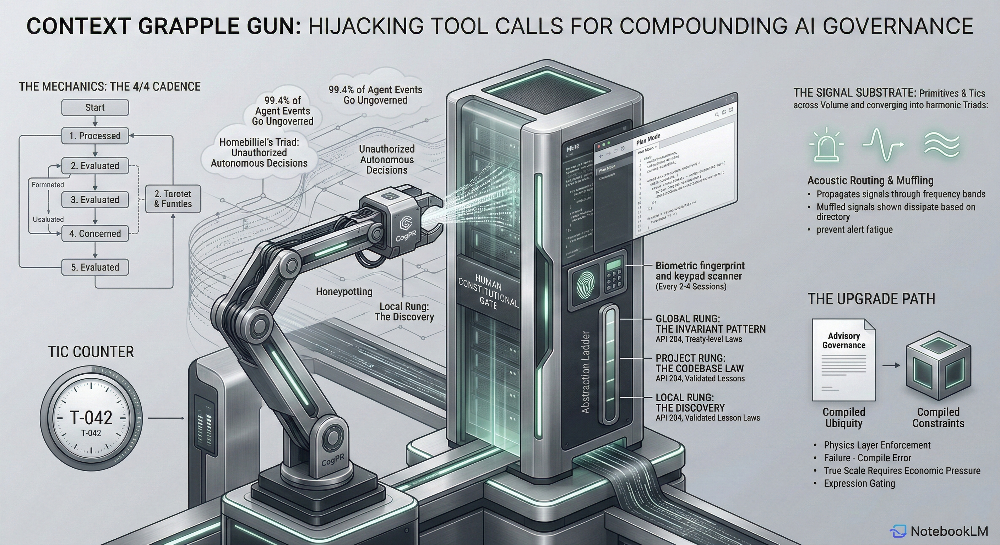

<p align="center">
  
</p>

# Context Grapple Gun

Context Grapple Gun is a portable governance lifecycle for Claude Code and a developer-facing entry point into Prompted LLC's Ubiquity substrate.

CGG turns session-local human-agent learning into scoped, reviewable, receipted operating structure. It preserves the distinction between canonical source, installed plugin, loaded runtime, human judgment, and future hydration instead of calling all of them “memory.”

Three commands are the public operating surface:

| Command | Governing job |
|---|---|
| `/cadence` | Close the epoch, emit the canonical tic, seal the handoff, and leave a resumable next state. |
| `/review` | Let the named human authority approve, modify, defer, merge, supersede, or reject durable promotion. |
| `/siren` | Inspect the recurring-friction signal manifold without turning visibility into promotion authority. |

## Install

```bash
npx context-grapple-gun@5 install
```

The v5 npm package contains the exact plugin/runtime payload it installs. It no longer clones a moving `main` branch and calls the result a versioned install.

Default behavior:

- mode: `full`
- Claude plugin scope: `user`
- durable package source: `vendor/context-grapple-gun`
- governance zone: current project root
- completion: strict plugin validation, installed record, component inventory, zone checks, and an install receipt

See [START-HERE.md](START-HERE.md) for the operating rhythm and [INSTALL.md](INSTALL.md) for modes, scopes, direct GitHub installation, diagnostics, reconciliation, and uninstall.

## What v5 governs

```text
npm package or Git commit
  -> marketplace source
  -> plugin manifest
  -> installed plugin
  -> loaded component inventory
  -> project governance zone
  -> human-gated promotion
  -> future hydration
```

The public distribution invariant is:

> No success claim until the package, plugin declaration, loaded inventory, and project zone agree.

The source plugin manifest is the component authority. The marketplace identifies the source; it does not carry a second partial component map. Git installs use the Git commit as version authority. npm installs generate a mode-specific manifest stamped with the npm package version and preserve that state in `cgg-install-receipt.json`.

## Install modes

| Mode | Public components | Hooks | Agents | Zone bootstrap |
|---|---|---:|---:|---:|
| `full` | Core commands, compatibility surfaces, and admitted operational skills | Yes | Yes | Yes |
| `skills` | `/cadence`, `/review`, `/siren` and supported compatibility wrappers | No | No | Yes |
| `convention` | Current Session Learning Protocol appended to project `CLAUDE.md` | No | No | No |

The public component set is governed by `cgg-runtime/config/plugin-components.json`. Deprecated surfaces and unrefreshed teaching artifacts do not enter the plugin merely because they exist in the repository.

## Authority boundaries

- `/cadence` owns epoch close and handoff sealing. It is not the memory writer, signal emitter, assessor, extractor, or review authority.
- `/review` owns constitutional judgment. Agents may prepare evidence and mechanical mutations; they do not self-ratify promotion.
- `/siren` owns signal operations. Signal volume does not grant sovereignty.
- The Claude plugin manager owns plugin installation and loaded component state.
- `/init-governance` owns project-zone bootstrap and repair after installation. It does not copy plugin components or rewrite Claude settings.
- Loaded runtime is behavioral truth. Canonical source remains intent until installation and verification complete.

## Flat-file boundary

CGG is complete as a local, auditable governance lifecycle. It deliberately avoids pretending that flat files are a semantic substrate.

When lexical lookup, file topology, and human review are no longer sufficient, Ubiquity extends the same primitives into semantic recall, graph topology, conformation-aware retrieval, expression gating, and compiled execution-boundary enforcement.

## Source map

| Need | Authority |
|---|---|
| Use CGG | [START-HERE.md](START-HERE.md) |
| Install and remove it | [INSTALL.md](INSTALL.md) |
| Understand the operating pipeline | [DEV-README.md](DEV-README.md) |
| Evaluate the theory and scale boundary | [ARCHITECTURE.md](ARCHITECTURE.md) |
| Inspect runtime topology | [CGG_RUNTIME_TOPOLOGY_AND_LIFECYCLE.md](CGG_RUNTIME_TOPOLOGY_AND_LIFECYCLE.md) |
| Resolve current terms | [docs/TERMINOLOGY.md](docs/TERMINOLOGY.md) |
| See release deltas | [CHANGELOG.md](CHANGELOG.md) |

## Academy standing

The prior Homeskillet Academy is intentionally excluded from the public v5 plugin while it is re-derived against the current runtime. The refresh is tracked in [GitHub issue #17](https://github.com/prompted365/context-grapple-gun/issues/17). Until that gate closes, use the current guides above rather than the legacy course as installation or architecture authority.

## Safety

- Durable promotion requires the human `/review` gate.
- Existing `.ticzone`, `.ticignore`, `CLAUDE.md`, `MEMORY.md`, and audit history are not overwritten by installation.
- `PRESTIGE` is governance-blocked and never appears in a newly created active band list.
- An existing constitutional conflict is held for human repair rather than silently rewritten.
- Uninstall preserves project governance history by default.
- Marketplace removal is explicit because it can affect more than one plugin scope.

## License

MIT

## Maintainers

**[Prompted LLC](https://promptedllc.com)** — creators of the Ubiquity governance substrate.

Breyden Taylor, Founder & Architect — [LinkedIn](https://www.linkedin.com/in/breyden-taylor/) | breyden@prompted.community
