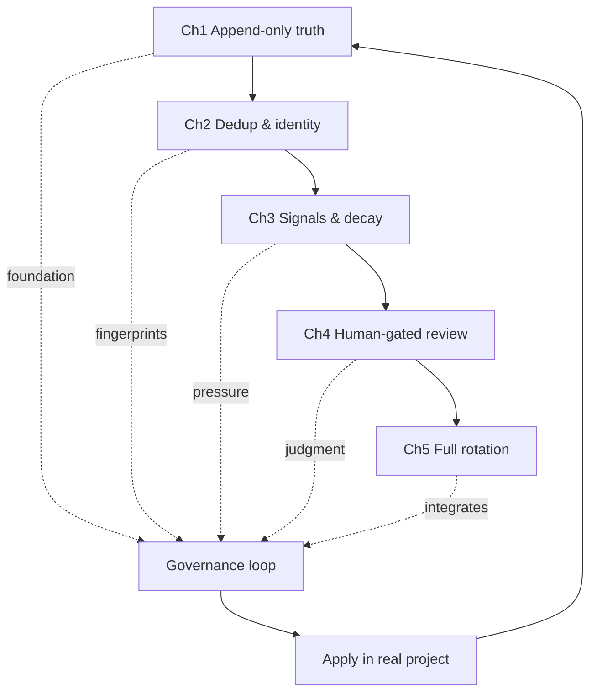

# Homeskillet Academy

**Learn CGG through stories.** Five chapters. Three worlds. One very persistent goat.

---

## Why stories?

Governance concepts are abstract. Abstract concepts taught abstractly produce surface understanding — you can recite the definition but not apply it under pressure.

The Academy teaches through *narrative simulations*: real scenarios with real data, real conflicts, and real resolutions. When you understand why the Taylor family calendar can't just delete events, you understand append-only truth stores. When you feel the frustration of the bridge inspector's growing pile, you understand why human-gated review needs feedback loops.

Stories produce intuition. Intuition survives context pressure.

## Why the goat?

Mabel is not decoration. She's the thread that connects all five chapters.

In Chapter 1, she appears as an unexplained anomaly. By Chapter 5, you'll understand how signals route, why warrants mint, and what it means to resolve escalated friction. Mabel is the worked example of the entire governance lifecycle — from first appearance to final resolution.

If you can trace Mabel, you understand CGG.

## What you will understand

By the end of the Academy:

- **The governance loop**: capture → evaluate → review → promote
- **The abstraction ladder**: local → project → global scope
- **The signal manifold**: how friction accrues, routes, and escalates
- **The human gate**: why approval matters and where it goes
- **The dual-lesson model**: subject-matter AND collaboration patterns are governance artifacts

These are the same primitives the CGG runtime uses. The Academy teaches them through narrative; the runtime applies them through automation.

---

## How it works

Claude walks you through each chapter — telling the story, running live simulations, and checking that the concepts land. No coding required. If something isn't clicking, Claude re-explains. If a chapter doesn't grab you, Claude shows the key insight and moves on.

| # | Chapter | The story | What it teaches |
|---|---------|-----------|-----------------|
| 1 | [The Taylor Family Calendar](chapters/01-append-only-truth/README.md) | A family of five, one shared calendar, and the rule that changes everything | Append-only truth stores, duplicate vs recurrence |
| 2 | [The Adjunct's Semester Project](chapters/02-dedup-and-identity/README.md) | A college professor, three student groups, and what makes teams succeed | Collaboration governance — promotable coordination patterns |
| 3 | [Zookeeper Radio](chapters/03-signals-and-decay/README.md) | A zoo PA system, four frequency bands, and lions who overhear lunch plans | Signals, bands, acoustic routing |
| 4 | [Bridge Inspector](chapters/04-human-gated-review/README.md) | Seventeen bridges, one inspector, and a pile that won't stop growing | Human-gated review, feedback loops |
| 5 | [Graduation](chapters/05-completion/README.md) | Wire it all together and trace the goat | Full pipeline integration |

## What the course teaches

CGG captures two classes of governance artifacts:

- **Subject-matter lessons** — truths about the system being built (bug patterns, API quirks, architecture constraints)
- **Collaboration lessons** — truths about effective human-agent coordination (prompting patterns, debugging rhythms, escalation protocols)

Both are valid CogPR candidates. Both can climb the abstraction ladder. Both are reviewed through the same constitutional gate. The academy teaches this through interactive narratives, not prose.

## Learning path overview (Mermaid)



## About that goat

You'll notice something odd in Chapter 1's data. An entry that doesn't fit. Don't worry about it.

Yet.

## After the course

Three guides for what comes next:

- [Posture guide](chapters/guides/posture.md) — the four working quadrants in depth
- [Ticignore scoping](chapters/guides/ticignore-scoping.md) — zone scanning and monorepo patterns
- [Installing CGG](chapters/guides/installing-cgg.md) — put CGG in a real project

## Getting started

Use the `/homeskillet-academy` skill to scaffold a workspace and begin:

```
/homeskillet-academy
```

Claude sets up the workspace, installs the simulations, and starts teaching Chapter 1. You follow the story.
