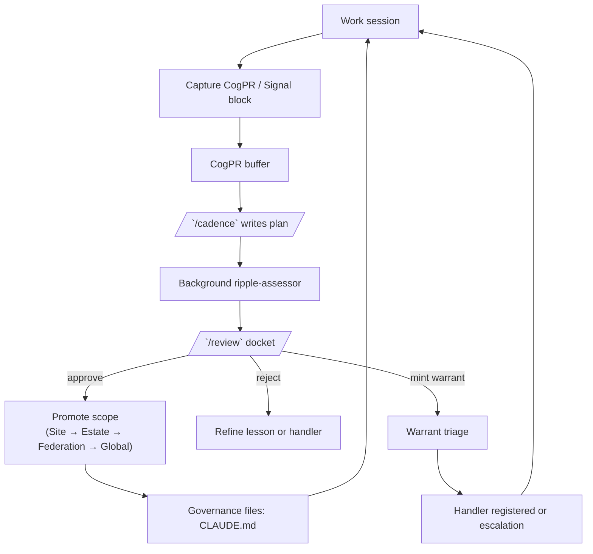

# CogPR v3 — Cognitive Pull Request Conventions (Signal Manifold)

Lesson flagging, signal emission, and cross-scope promotion conventions for Claude.

> Convention reference for CogPR/Signal/Warrant block formats. For the automation pipeline, see [cgg-runtime/](../cgg-runtime/skills/README.md). For the full architecture, see [README.md](../README.md).

## CogPR and signal learning loop (Mermaid)

## What's New in v3

- **Unified signal schema**: All primitives (CogPR, Siren, Warrant) share `band`, `motivation_layer`, `subsystem`, `source`
- **Band budget hierarchy**: PRIMITIVE > COGNITIVE > SOCIAL > PRESTIGE (blocked)
- **Inline signal blocks**: `<!-- --signal -->` for persistent conditions that need monitoring
- **CogPR field additions**: `band`, `motivation_layer`, `subsystem`, `source` now required

## Variants

| Platform | Path | Install method |
|----------|------|---------------|
| Claude Code | `claude-code/` | Copy skills to `.claude/skills/` (absorbed into bootstrap) |
| Claude Desktop | `claude-desktop/` | Paste `project-instructions.md` into Project custom instructions |
| Claude for Work | `claude-work/` | Paste `project-instructions.md` into Project custom instructions |

## What's Included

### Claude Code
- `/review` v3 skill — unified CogPR + Warrant docket with harmonic triad detection
- Bootstrap installs all 3 block formats + band budget + signal capture rules

### Claude Desktop / Claude for Work
- Project instructions with v3 capture rules, all block formats, band budget, and review workflow
- No slash commands — say "review my CogPR flags" or "review" to trigger review

## Standalone Usage

CogPR works without the CGG runtime. Lessons and inline signals are evaluated manually when you request review. The CGG runtime (`cgg-runtime.zip`) adds:
- Automated between-session evaluation via the trigger pipeline
- `/siren` skill for signal emission, tick advancement, and triage dashboard
- JSONL signal store with volume accrual and warrant minting
- SessionStart hook for automatic signal scanning

## Signal Primitives

| Primitive | Block tag | Purpose | Reviewed by |
|-----------|-----------|---------|-------------|
| CogPR | `<!-- --agnostic-candidate -->` | Durable lesson to promote | `/review` Section C |
| Siren | `<!-- --signal -->` | Persistent condition to monitor | `/siren` + `/review` Section B |
| Warrant | `<!-- --warrant -->` | Stress crystallized — action required | `/review` Section A+B |

## Band Budget

| Band | Level | Governance |
|------|-------|------------|
| PRIMITIVE | Foreground (0 dB) | Safety/survival. Always audible. |
| COGNITIVE | Midground (-6 dB) | Lessons/insights. Standard working level. |
| SOCIAL | Background (-12 dB) | Collaboration. Use sparingly. |
| PRESTIGE | Auto-muted | NEVER emit. Governance filter blocks this band. |

## Optional birth context fields (v3.1)

When capturing CogPRs during an active session with posture tracking, these optional fields provide richer context for `/review`:

- `posture`: Agent posture at discovery (e.g., "ENG/META", "OPS/DIRECT")
- `cwd_context`: Working directory relative to project root
- `birth_tic`: Nearest tic count at discovery time

Posture is advisory in CGG. Include it when available -- it helps `/review` weigh whether a lesson came from active implementation or analysis. See [INSTALL.md](../INSTALL.md) for the full posture convention.
