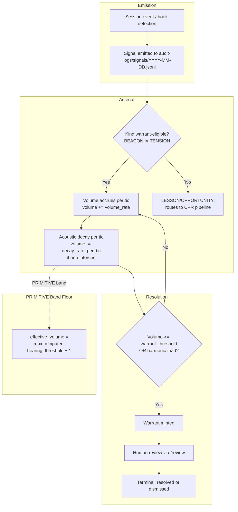
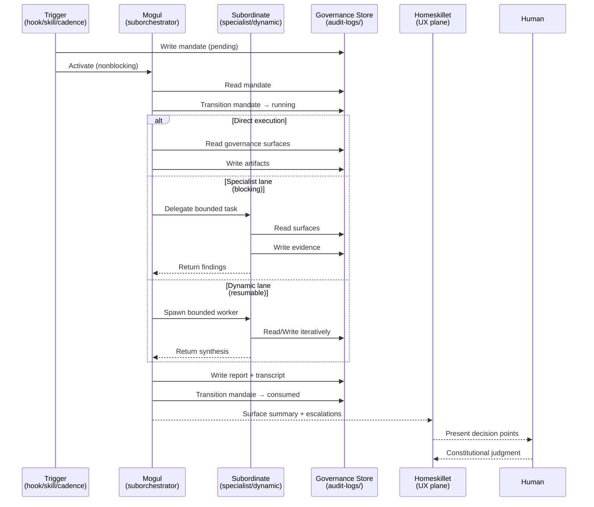
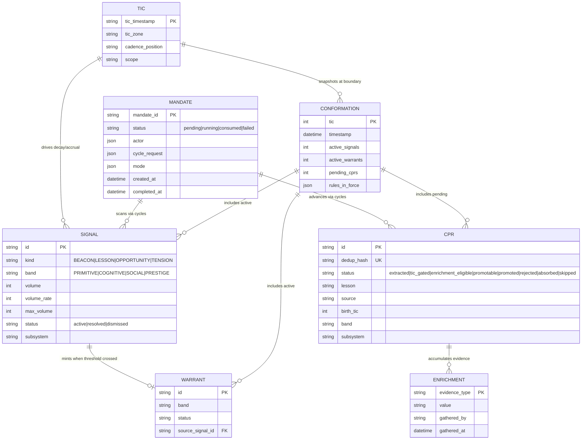

# CGG System Diagrams

Portable system architecture diagrams for Context Grapple Gun v3.

Actor names in these diagrams (Mogul, Homeskillet, Swann) are estate-specific
instantiations of CGG's generic roles: suborchestrator, UX plane, clock authority.

## 1. Signal Lifecycle Flow



## 2. Mandate Execution Sequence



## 3. Governance Entity Relationship Diagram



## 4. Component Architecture

```mermaid
graph TB
    subgraph PhysicsLayer["Physics Layer (deterministic enforcement)"]
        H1[cgg-bash-policy.py / PreToolUse]
        H2[cgg-completion-gate.py / Stop]
        H3[cgg-session-reinjection.sh / SessionStart or compact]
        H4[cgg-precompact-guard.sh / PreCompact]
        H5[cgg-subagent-provenance.py / SubagentStart or Stop]
        H6[cgg-config-audit.py / PostToolUse Write or Edit]
    end

    subgraph ScriptLayer["Script Layer (operational primitives)"]
        S1[signal-audit.py / --json metrics or view or audit]
        S2[runtime-sync.py / --json check or diff or sync]
        S3[burst-governor.py / tic emission plus economy]
        S4[governance-router.py / signal to action routing]
        S5[zone_root.py / path resolution primitive]
    end

    subgraph SkillLayer["Skill Layer (workflow payloads)"]
        SK1[/cadence / session epoch boundary]
        SK2[/review / constitutional bench]
        SK3[/siren / signal emission & triage]
        SK4[/telos-springboard / paper patching]
    end

    subgraph AgentLayer["Agent Layer (bounded judgment)"]
        MG[Mogul / governance suborchestrator]
        RA[Ripple Assessor / CPR evaluation]
        LA[Ladder Auditor / coherence audit]
        PC[Pattern Curator / MEMORY mining]
    end

    subgraph DataStores["Data Stores"]
        DS1[(audit-logs/signals/ JSONL append-only)]
        DS2[(audit-logs/cprs/ queue.jsonl)]
        DS3[(audit-logs/tics/ JSONL per day)]
        DS4[(audit-logs/mogul/ mandates and reports)]
        DS5[(audit-logs/conformations/ tic-N.json snapshots)]
        DS6[(.ticzone acoustic region config)]
    end

    subgraph UXLayer["UX + Synthesis"]
        HS[Homeskillet Opus 4.6]
    end

    subgraph ClockLayer["Clock Authority"]
        SW[Swann Governor Source-of-Clock sovereign]
    end

    %% Relationships
    HS -->|steers| MG
    MG -->|delegates| RA
    MG -->|delegates| LA
    MG -->|delegates| PC
    MG -->|surfaces| HS

    PhysicsLayer -.->|enforces rails| AgentLayer
    ScriptLayer -.->|invoked by| AgentLayer
    SkillLayer -.->|loaded by| AgentLayer
    SkillLayer -.->|loaded by| HS

    SW -->|emits tics| DS3
    SW -->|drives| DS1

    MG -->|reads/writes| DS1
    MG -->|reads/writes| DS2
    MG -->|reads| DS3
    MG -->|writes| DS4
    MG -->|reads| DS5

    S2 -->|syncs| ScriptLayer
    S1 -->|audits| DS1

    H3 -->|rehydrates from| DS4
    H4 -->|guards| DS4
    H5 -->|logs to| DS4
```
